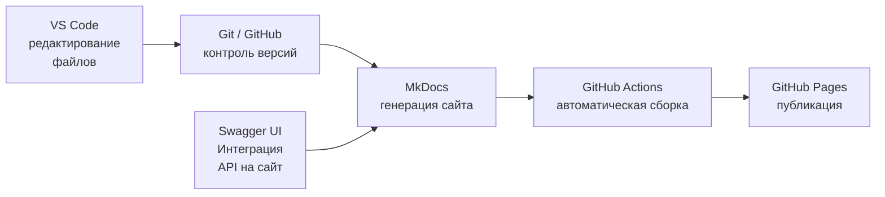

# Выбор инструментов

Вот как выглядит мой стек:

Для портфолио я использовал инструменты, которые стали стандартом в технической документации:

- **VS Code** — лёгкий и сильный редактор с поддержкой Markdown, Git и плагинов для работы с документацией.
- **Git и GitHub** — контроль версий, хранение репозитория и возможность автоматической публикации через Actions и хостинга через GitHub Pages.
- **MkDocs** — генератор статических сайтов. Он идеально подходит для документации: прост в настройке, поддерживает кастомизацию и плагины, а главное — позволяет хранить документацию в репозитории и работать с ней как с кодом, стандарт для Docs as Code.
- **Swagger UI** — для интерактивной документации API. Позволяет не только описывать эндпоинты, но и отправлять тестовые запросы прямо из браузера, что делает документацию полезной и удобной для разработчиков.

Этот набор даёт всё необходимое: от написания текста до публикации сайта, без лишней сложности.

**Дальше** — [Настройка MkDocs](02-setup.md)