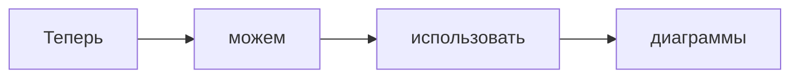

# Интеграция Mermaid

**Mermaid** — это инструмент для создания диаграмм прямо в Markdown. Он позволяет визуализировать процессы, структуры и связи без использования внешних редакторов.

Диаграммы делают документацию более наглядной и удобной для восприятия, не требуют отдельной вёрстки и обновляются вместе с текстом — это удобно для документации, которая живёт в репозитории.

---

## Подключение

Чтобы Mermaid работал в MkDocs, я добавил в `mkdocs.yml` две вещи:

1. Расширение для обработки блоков `mermaid`:

```yaml
markdown_extensions:
  - pymdownx.superfences:
      custom_fences:
        - name: mermaid
          class: mermaid
          format: !!python/name:pymdownx.superfences.fence_code_format
```
2. Подключение библиотеки Mermaid через CDN:

```yaml
extra_javascript:
  - https://unpkg.com/mermaid@11.14.0/dist/mermaid.min.js
```


---

## Пример

Теперь используя такую структуру:

````plaintext

````
> Здесь блок кода вместо диаграммы мы видим, потому что внутри он экранирован

Мы получаем такую диаграмму:


**Дальше** — [Интеграция Swagger UI](04-swagger.md)